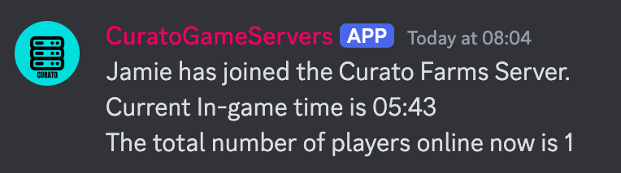
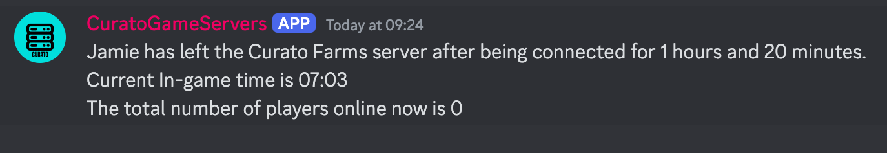

Farming Simulator FS25 Player Monitor Discord Bot
=================================================

This Discord bot monitors player activity on a Farming Simulator 25 server by periodically checking an XML feed for player status. The bot posts updates to a specified Discord channel when players join or leave, including the in-game time, session duration, and total number of players online.

Features
--------

-   **Player Join and Leave Notifications**: Posts a message to the Discord channel whenever a player joins or leaves the server.
-   **In-Game Time and Duration Tracking**: Shows the current in-game time and the total connection duration when a player leaves.
-   **Player Count**: Keeps track of and displays the number of players currently online.

Prerequisites
-------------

-   **Python 3.7+** is required to run this bot.
-   **Discord Bot Token**: You need a bot token from the Discord Developer Portal.
-   **Permissions**: The bot requires permission to send messages in the target Discord channel.
-   **Libraries**: The bot uses the following Python libraries:
    -   `discord.py`: For interacting with the Discord API.
    -   `requests`: For fetching XML data from the Farming Simulator server.

Installation
------------

1.  **Clone the repository**:

    `git clone https://github.com/CurtisFeatures/fs25-player-monitor-discord-bot.git
    cd fs25-player-monitor-discord-bot`

2.  **Install dependencies**:

    `pip install discord.py requests`

3.  **Set up your configuration**:

    -   Replace `YOUR_DISCORD_BOT_TOKEN` and `YOUR_CHANNEL_ID` in the code with your Discord bot token and channel ID.
      
4.  **Run the bot**:

    `python PlayerMonitor.py`

Usage
-----

Once the bot is running, it will:

1.  Periodically check the XML feed for active players.
2.  Post a message in the Discord channel when:
    -   A player joins the server.
    -   A player leaves the server (along with their session duration and the current in-game time).
3.  Maintain and update the count of players currently on the server.

### Example Message

The bot will post messages in this format:

Customization
-------------

-   **XML URL**: Replace the `XML_URL` variable with the URL to your Farming Simulator server XML feed.
-   **In-Game Time Display**: The `dayTime` attribute from the XML is converted from milliseconds into a 24-hour time format for display purposes. You can customize the display logic if needed.

Troubleshooting
---------------

-   **Bot Not Posting Messages**: Ensure the bot has permission to post in the specified Discord channel.
-   **XML Feed Issues**: If the XML URL is unreachable or incorrectly formatted, the bot will be unable to fetch player information.
-   **Error Messages**: Errors will be printed in the console where the script is running, which can help diagnose issues with XML parsing or Discord API errors.

Contributing
------------

Contributions are welcome! If you have suggestions or improvements, feel free to submit a pull request.

